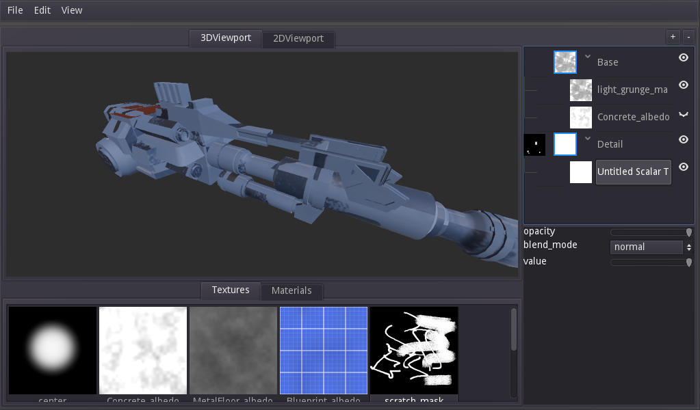

# Material Painter

 [](https://godotengine.org) [](https://jummit.itch.io/material-painter) [](https://jummit.github.io/material-painter-docs)

A Substance Painter alternative made in the Godot Engine.



**WARNING: This tool is in a very early stage and is actively being developed. It is in no way feature complete or ready for actual use.**

# Contributing

This project uses an experimental [Package Manager](https://github.com/Jummit/godot-package-manager) to install addons and their dependencies.

Before opening the project in Godot, install the submodules and download the addons:

```bash
git clone git@github.com:Jummit/material-painter.git
cd material-painter
git submodule update --init
cd package_manager
python package_manager.py
```
