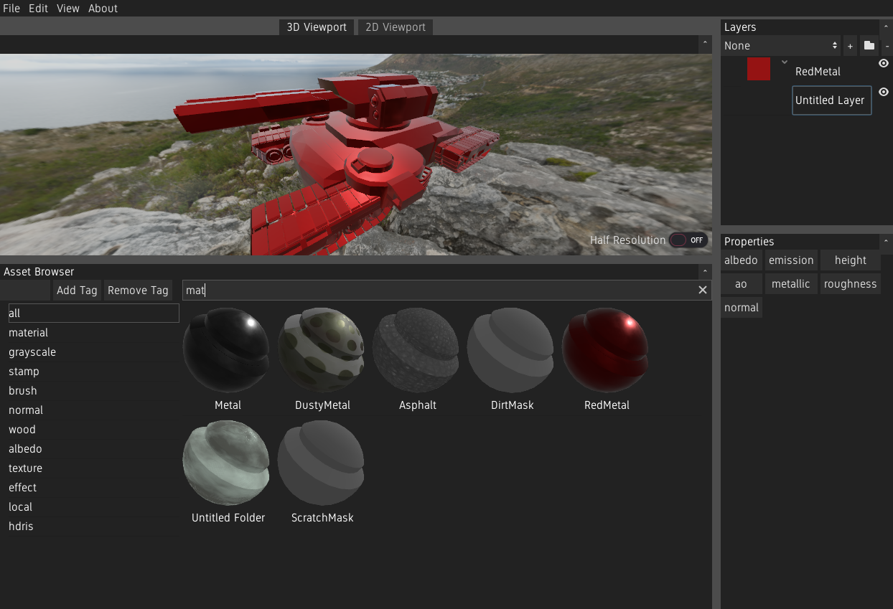

# Material Painter

A Substance Painter alternative made in the Godot Engine.



**WARNING: This tool is in a very early stage and is actively being developed. It is in no way feature complete or ready for actual use.**

**Note:** Because git submodules are used,

```bash
git submodule update --init
```

needs to be run in the project directory after a clone to complete initialisation.
